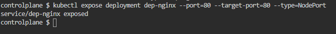

# Deployment and Service in Kubernetes

## Questions
     * Create a deployment named dep-nginx with nginx image and 3 replicas.
     * Expose it's port 80 through a service of type NodePort.
     * Show all elements, including the endpoints.
     * Get the nginx index page through the NodePort.

## Solutions

 
