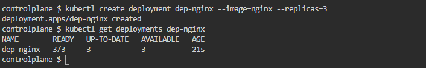
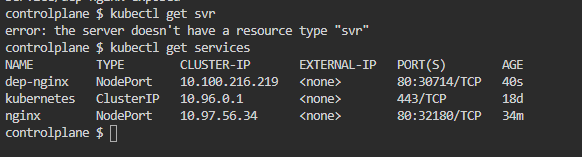
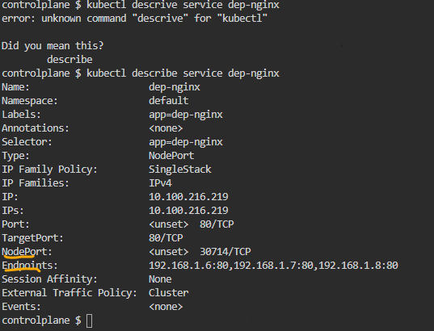
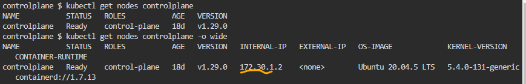
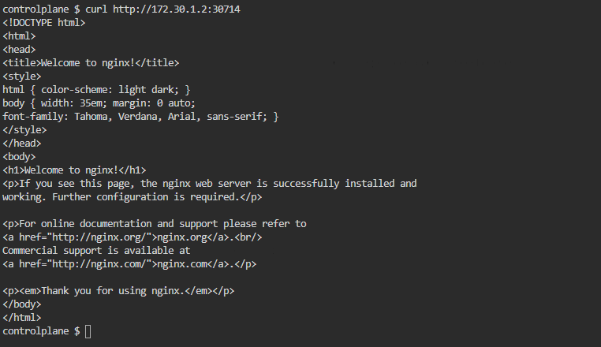

# Deployment and Service in Kubernetes

## Questions
    1 - Create a deployment named dep-nginx with nginx image and 3 replicas.
    2 - Expose it's port 80 through a service of type NodePort.
    3 - Show all elements, including the endpoints.
    4 - Get the nginx index page through the NodePort.

## Solutions

   1

   2 
 

   3

   4
 
